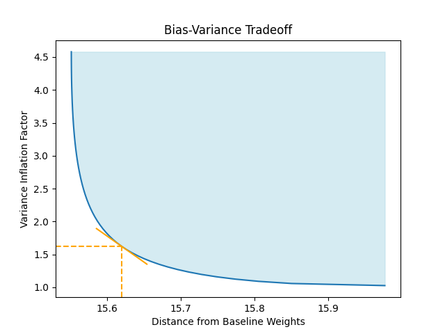
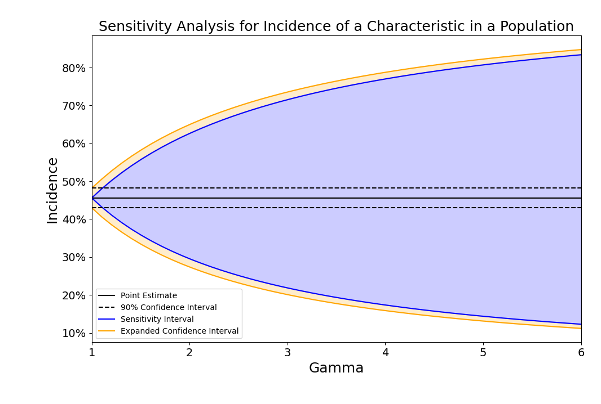

# PyRake

[](https://github.com/rwilson4/PyRake/actions/workflows/ci.yml)

PyRake is a Python library for calculating balancing weights to adjust
surveys for non-response bias. Balancing weights try to accomplish
three things:
1. Reduce bias (by using an estimator emphasizing under-represented
   respondents)
2. Improve representativeness (by balancing important covariates)
3. Reduce variance (by controlling the sizes of the weights)

If we knew the probability each person would respond to the survey, a
natural choice of weight is
$` w_i = (M/N) / \pi_i, `$
where M people respond to the survey out of a total population size of
N, and $` \pi_i `$ is the response propensity score. Then
$` (1/M) \sum_i w_i \cdot Y_i `$ is unbiased for the population
average (Horvitz and Thompson, 1952).

(NB: the Horvitz-Thompson estimator is often written
$` (1/N) \sum_i w_i \cdot Y_i, `$ with $` w_i = 1 / \pi_i. `$
I prefer the notation from the previous paragraph, with a typical
weight around 1, in direct parallel to an unweighted average. A
typical Horvitz-Thompson weight is much larger than 1 and depends on
the population and sample sizes, which makes it harder to have
intuition about what the weights *should* be.)

Typically the propensity scores are unknown and must be estimated, but
in that scenario we cannot expect the corresponding estimator to be
unbiased. The best we can hope is for the bias to be small. Given that
an unbiased estimator is unattainable, we might as well see what else
weights can give us.

We might ask the weights exactly balance important covariates. If
$` X_i `$ is the covariate value for person i, and we know the mean of
this covariate is $` \mu `$ in the population, we might ask
$` (1 / M) \sum_i w_i \cdot X_i = \mu, `$ and we might ask this not
just for one covariate but perhaps several important covariates
believed to be correlated with the response of interest. Balancing
covariates adjusts the sample to be more representative of the
population of interest and improves the trustworthiness of the
estimate. If enforcing this constraint, a process called
*calibration*, forces us to deviate from estimated propensity scores,
it may increase bias. But since the true propensity scores are
unknown: we don't know how biased the uncalibrated estimates are; we
certainly don't expect them to be unbiased; and improving
representativeness *may* actually *reduce* bias.

The *design effect* is a common way of quantifying the efficiency of
an unrepresentative sample. It's the ratio of the adjusted and
unadjusted variances, and for simple weighted estimators is
$` \frac{(1/M) \sum_i w_i^2}{ ((1/M) \sum_i w_i)^2 }. `$ Often we
scale the weights to have mean 1, so the design effect is simply the
mean squared weight, $` (1/M) \| w \|_2^2. `$ Choosing weights with a
smaller mean square will typically lead to narrower confidence
intervals, at the possible expense of more bias. This leads to a
bias/variance tradeoff: staying close to the estimated propensity
scores keeps the bias in check, while pursuing smaller weights reduces
variance.

PyRake can be used for solving problems of the form:<br />
$`
\begin{array}{ll}
\textrm{minimize}    & D(w, v) \\
\textrm{subject to}  & (1/M) X^T w = \mu \\
           & \| (1/M) Z^T w - \nu \|_\infty \leq \psi \\
           &  (1/M) \| w \|_2^2 \leq \phi \\
           & w \succeq 0,
\end{array}
`$<br />
where D is a distance metric that keeps w close to $` v = (M/N)/\hat{\pi}, `$
and $` \hat{\pi} `$ are the estimated propensity scores. We support
multiple distance metrics, including an L2 error metric, KL
Divergence, and a Huber penalty. If the user does not have estimated
propensity scores, the code defaults to v=1. This will give you
weights that exactly balance the specified covariates with a
constraint on variance, but no connection to propensity scores.

The constraint on the $` l_\infty `$ norm is a loosening of the exact
covariate balance imposed by the equality constraints. In this case,
we don't require exact covariate balance, but we insist that no
covariate is imbalanced worse than the amount implied by $` \psi. `$

PyRake can also be used to solve a sequence of these problems, with
varying $` \phi `$. This allows the user to visualize the bias/variance
tradeoff.



While it may seem desirable to stay as close as possible to the
baseline weights (while enforcing balance on important covariates),
graphs like the one above show that it is often possible to
dramatically reduce variance, by deviating only slightly farther from
the baseline weights.

## Connection with Other Methods
Popular methods for reweighting include Raking, Entropy Balancing, and
Stable Balancing Weights. These can be seen as special cases or
modifications of the problem family PyRake solves.

Raking (Deming and Stephan, 1940) solves:<br />
$`
\begin{array}{ll}
\textrm{minimize}    & D(w, v) \\
\textrm{subject to}  & (1/M) X^T w = \mu \\
           & w \succeq 0,
\end{array}
`$<br />
where D(w, v) is the KL divergence; v is typically chosen to be
uniform (that is, all entries of v are ones). As the name implies,
PyRake can be used to calculate Raking weights, if we set $` \phi `$
to be large enough that the variance constraint is not active.

Like Raking, Entropy Balancing (Hainmuller, 2012) uses KL divergence
as the distance metric and omits the variance constraint. An
additional constraint is applied: $` 1^T w = 1^T v`$. This constraint
can be accommodated by adding an extra column to X having all ones;
the corresponding entry in $`\mu`$ should be $` (1/M) \cdot 1^T v `$.
PyRake makes it easy to add such a constraint, just pass
`constrain_mean_weight_to=np.mean(v)` to the Rake constructor.
(We tend to think in terms of mean weights rather than sums of
weights; a mean weight of 1 corresponds to a true weighted average.
Note that if we knew the true propensity scores, unbiased weights
would not necessarily have mean 1, and would not correspond to a
true weighted average.)

Stable Balancing Weights (Zubizarreta, 2015) use
$` D(w, v) = \| w - v \|_2^2, `$ which is supported by PyRake.

## Estimators
Once suitable weights have been chosen, we can use them to estimate
the mean of some quantity in a population based on a sample. As noted
above, a natural estimator is $` (1/M) \sum_i w_i \cdot Y_i. `$ When
$` w_i = (M/N) / \pi_i, `$ we call this the IPW, or Inverse Propensity
Weighted estimator. If the weights summed to $` M, `$ (or
equivalently, the mean of the weights equaled 1) this would be a true
weighted average, but nothing in the structure of propensity scores
guarantees this to hold exactly.

Many analysts therefore normalize the weights to enforce a true
weighted average. The *stabilized,* or SIPW estimator is:
$` \frac{\sum_i w_i \cdot Y_i}{\sum_i w_i}. `$ One advantage of the
SIPW estimator is that the resulting estimate will always be between
the smallest and largest value of $` Y_i, `$ which is not always the
case with the IPW estimator. For example, with binary outcomes, the
IPW estimator may estimate the population mean as larger than 1, which
is known to be incorrect a priori. This doesn't happen with the SIPW
estimator.

Sometimes we may have some kind of model, $` \mu, `$ that predicts the
outcome, $` Y, `$ based on covariates, $` X, `$ that are observed for
everyone in the sample and everyone in the population. We can
*augment* the estimator, splitting the work of estimating the
population mean of $` Y `$ across the outcome model and the IPW
estimator: <br />
$` \frac{1}{N} \sum_{i=1}^N \mu(X_i) + \frac{1}{M} \sum_{i \in \mathcal{R}} w_i \cdot (Y_i - \mu(X_i)), `$<br />
where the first sum is over everyone in the population, and the second
limited to the sample. This estimator uses the outcome model to
estimate the outcome for everyone in the population, averages those
outcomes to estimate the mean, then adjusts this estimate with a
weighted sum of residuals from the sample. The latter term can use a
weighted average (SIPW) rather than a weighted sum (IPW).

These augmented methods have a doubly-robust property: if the
propensity scores are correct, *or* the outcome model is correct (in
the sense that $` \mu(x) = \mathbf{E}[ Y | X=x ] `$ ), then the
augmented estimator is unbiased. Even when the outcome model is
incorrect, augmented estimators can have lower variance and less
sensitivity to errors in the propensity score than unaugmented
estimators.

PyRake defines *estimators* for each of these scenarios: the simplest
`IPWEstimator`; a stabilized variant, `SIPWEstimator`; an augmented
variant requiring an outcome model, `AIPWEstimator`; and a stabilized
augmented estimator, `SAIPWEstimator`. These estimators calculate
point estimates, the variance, Wald-style confidence intervals (point
estimate plus or minus some multiple of the square root of the
variance), and p-values against some hypothesized population mean.

## Causal Inference
Estimating the average treatment effect can be thought of as
estimating the population averages of two potential outcomes, and then
subtracting them. Given a population of units, some of which select
treatment (not necessarily at random), we can reweight outcomes in
that group to estimate the population mean of $` Y(1). `$ Outcomes for
the remaining control units may be reweighted to estimate the
population mean of $` Y(0). `$ We can thus think of causal inference
as being just two population mean estimators taped together. PyRake
defines an `ATEEstimator` for doing just that.

We may wish instead to estimate the average effect of treatment on the
units selecting treatment, or not selecting treatment. PyRake defines
`ATTEstimator` and `ATCEstimator` for these scenarios.

Sometimes the units being analyzed in a causal inference are
themselves a sample from a population, and perhaps that sample is not
representative of the population of interest. We may then have *two*
sets of weights: for adjusting for non-random treatment selection, and
to make the sample more representative of the target population. All
of the treatment effect estimators in PyRake permit specifying
sampling propensity scores to estimate population average effects.


## Sensitivity Analysis
The weights used to make the sample more closely resemble the target
population, or to adjust for non-random treatment selection, are
typically estimated, not known. They are subject to two distinct
sources of uncertainty: haphazard and systematic. Haphazard
uncertainty occurs any time we try to learn a relationship from a
finite sample size, and can often be quantified with a bootstrap
procedure. Systematic uncertainty occurs when we do not observe all
the relevant characteristics influencing the relationship. In a causal
inference setting, these represent unobserved confounding, and lead to
*hidden biases* because we typically would not know their extent. A
similar phenomenon occurs in survey sampling: if important
characteristics correlated with the outcome influence the sampling
procedure, but are not included in the propensity score model, perhaps
because they are unobserved, it biases the estimators described above.

The estimators in PyRake include methods to explore the sensitivity of
estimates to these hidden biases, using the procedures from (Zhao,
Small, and Bhattacharya, 2019). We can calculate a range of point
estimates that reflect the uncertainty in the estimate due to errors
in the weights, or expand confidence intervals to account for this
additional uncertainty.




## References
W. Edwards Deming and Frederick F. Stephan, "On a least squares
adjustment of a sampled frequency table when the expected marginal
totals are known" (1940). Annals of Mathematical Statistics.

Daniel G. Horvitz and Donovan J. Thompson, "A generalization of sampling
without replacement from a finite universe" (1952). Taylor & Francis.

Jens Hainmuller, "Entropy balancing for causal effects: A multivariate
reweighting method to produce balanced samples in observational
studies" (2012). Political Analysis.

Qingyuan Zhao, Dylan S. Small, and Bhaswar B. Bhattacharya,
"Sensitivity analysis for inverse probability weighting estimators via
the percentile bootstrap" (2019). Oxford University Press.

José R. Zubizarreta, "Stable weights that balance covariates for
estimation with incomplete outcome data." (2015). Journal of the
American Statistical Association.


## Installation

```bash
pip install .
```

## Example Usage
### Calibration

```python
from pyrake.calibration import Rake, KLDivergence, EfficientFrontier

# Inputs: X (M x p), mu (p,), v (M,)
rake = Rake(
    distance=KLDivergence(),
    X=X,
    mu=mu,
    phi=2.0,
)
frontier = EfficientFrontier(rake)
res = frontier.trace()
res.plot()
```

### Estimation
```python
import pandas as pd
from pyrake.estimation import SIPWEstimator

df = pd.DataFrame(...)

estimator = SIPWEstimator(
    propensity_scores=df["score"],
    outcomes=df["outcome"],
)
estimator.point_estimate()
estimator.confidence_interval(alpha=0.10)
estimator.plot_sensitivity()

```

## Development
I used ChatGPT to write the original commit (it did a pretty good
job!)

### Architecture
We use [poetry](https://python-poetry.org/) to manage dependencies.
Test cases use [pytest](https://docs.pytest.org/en/latest/). We use
[black](https://github.com/python/black) and
[ruff](https://docs.astral.sh/ruff/) for formatting.

### Running the test cases
After cloning the repository, run `poetry shell`. That will create a
virtual environment. Then run `poetry install --no-root`. That will
install all the libraries needed to run the test cases (and the
package itself). Finally, run `python -m pytest` to run the test
cases.

### Linting
We use both black and ruff as python linters. To check if the code is
properly formatted, use: `python -m ruff check pyrake test` and
`python -m black --check pyrake/ test/`.

## License
Apache
